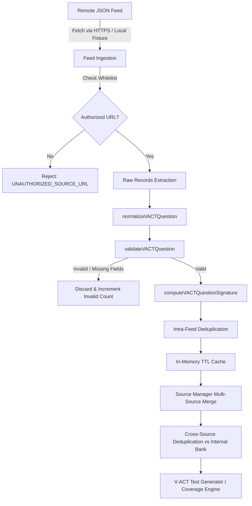

# K-EDU V-ACT External Question Source Integration Guide

## 1. Overview & Core Philosophy

This guide defines the architecture, JSON feed specifications, and security policies for connecting authorized external question feeds to the K-EDU V-ACT assessment engine.

> [!IMPORTANT]
> **Strict Legal & Ethical Compliance**:
> - **SOURCE INFRASTRUCTURE ONLY**: This infrastructure is designed solely for authorized partner repositories, official open data sets, and K-EDU-administered question servers.
> - **DO NOT SCRAPE COMMERCIAL WEBSITES**: Scraping third-party or commercial websites (e.g. vn-exams.com, online quiz vendors) is strictly prohibited.
> - **NO AUTHENTICATION OR PAYWALL BYPASS**: The ingestion pipeline will never attempt to circumvent login portals, paywalls, or rate limiters.
> - **NO PROPRIETARY CONTENT COPYING**: Only feeds with explicit licensing or authorized institutional consent may be registered.

---

## 2. Architecture & Normalization Pipeline

Every remote question ingested by K-EDU passes through a strict sequential pipeline before it can be used in test generation:



---

## 3. Remote JSON Feed Schema Specification

An authorized feed can provide a root JSON object containing feed-level provenance metadata along with a `questions` array:

```json
{
  "$schema": "https://k-edu.vn/schemas/vact-feed-v1.json",
  "provider": "Authorized University Partner / Publisher Name",
  "title": "V-ACT Practice Examination 2026",
  "year": 2026,
  "url": "https://api.k-edu.vn/feeds/vact-2026-partner.json",
  "questions": [
    {
      "id": "partner_phy_001",
      "section": "scientific_reasoning",
      "skill": "physics",
      "difficulty": "medium",
      "question": "Một con lắc lò xo dao động điều hòa với chu kỳ T = 0,5 s. Tần số dao động của con lắc là:",
      "options": [
        "A. 1 Hz",
        "B. 2 Hz",
        "C. 0,5 Hz",
        "D. 4 Hz"
      ],
      "correctAnswer": "B",
      "explanation": "f = 1 / T = 1 / 0,5 = 2 Hz.",
      "source": {
        "provider": "V-ACT Practice Consortium",
        "title": "Đề thi thử ĐHQG-HCM 2026",
        "year": 2026,
        "page": 12,
        "originalId": "phy_feed_101"
      },
      "quality": {
        "sourceVerified": true,
        "answerVerified": true,
        "reviewed": true
      }
    }
  ]
}
```

### 3.1 Field Specifications

| Field | Type | Required | Description |
| :--- | :--- | :--- | :--- |
| `id` | `string` | Yes | Unique identifier in feed |
| `section` | `string` | Yes | One of: `vietnamese`, `english`, `math`, `logic_data`, `scientific_reasoning` |
| `skill` | `string` | Optional | Canonical skill in taxonomy (e.g. `physics`, `algebra`, `logical_reasoning`) |
| `difficulty` | `string` | Optional | `easy`, `medium`, or `hard` (defaults conservatively to `medium` if legacy codes NB/TH/VD/VDC are provided) |
| `question` | `string` | Yes | Question stem text (supports LaTeX math notation) |
| `options` | `string[]` | Yes | Exactly 4 choices for single-choice questions |
| `correctAnswer` | `string` | Yes | Correct letter (`"A"`, `"B"`, `"C"`, `"D"`) or matching exact option text |
| `explanation` | `string` | Optional | Step-by-step solution / rationale |
| `source` | `object` | Optional | Provenance object preserving `provider`, `title`, `year`, `page`, `url` |
| `quality` | `object` | Optional | Flags: `sourceVerified`, `answerVerified`, `reviewed` (defaults to `false` if unverified) |

---

## 4. How to Register an Authorized Remote Feed

Remote sources are registered programmatically through `sourceManager`:

```javascript
const { VACTRemoteJsonSource, sourceManager, VACTSourceConfig } = window.KEDUVACT.sources;

// 1. If using a custom private domain, register prefix with administrator whitelist
VACTSourceConfig.addAuthorizedUrlPrefix('https://my-school.edu.vn/vact-feeds/');

// 2. Instantiate the remote source
const schoolFeed = new VACTRemoteJsonSource({
  id: 'school-vact-feed-01',
  name: 'Đề Luyện Thi Chuyên Đề 2026',
  url: 'https://my-school.edu.vn/vact-feeds/physics-advanced.json',
  priority: 100,             // Lower number = higher precedence (Internal is 10)
  ttlMs: 15 * 60 * 1000,     // 15-minute cache TTL
  timeoutMs: 8000            // 8-second request timeout
});

// 3. Register with the central Source Manager
sourceManager.registerSource(schoolFeed);
```

---

## 5. Security & Network Safeguards

1. **Strict Whitelisting**:
   - Only URLs matching approved hostnames (`*.k-edu.vn`, `*.edu-cloud.vn`, `*.githubusercontent.com`, `localhost`) or admin-added prefixes can be fetched.
   - Arbitrary URLs provided by students or end users are rejected immediately with `UNAUTHORIZED_SOURCE_URL`.
2. **Protocol Restrictions**:
   - Only `https:` is permitted in production environments (insecure `http:` is strictly rejected, except on localhost for development).
3. **Timeout & Failure Handling**:
   - In the event of network dropouts, 500 errors, or connection timeouts, the source safely flags `REMOTE_SOURCE_UNAVAILABLE` without crashing the application.
   - The test generator falls back seamlessly to the internal bank.

---

## 6. Multi-Tier Coverage Matrix

K-EDU's coverage engine reports availability across all registered sources:

```javascript
const coverageReport = await sourceManager.getCombinedCoverage();
```

Output breakdown example:
- **Internal**: Questions available in the local K-EDU question bank.
- **Remote**: Questions ingested and validated from active remote feeds.
- **Combined Unique**: Total usable unique questions after cryptographic deduplication.

```
Physics:
  Internal: 20
  Remote: 176
  Combined Unique: 185 (11 duplicates safely eliminated)
```
